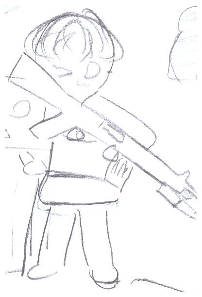
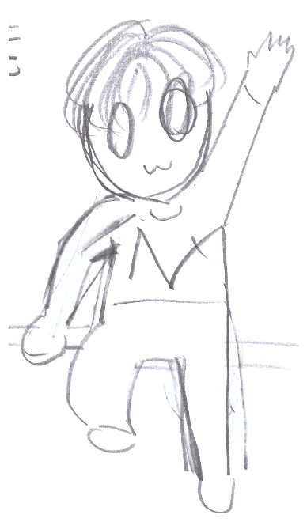
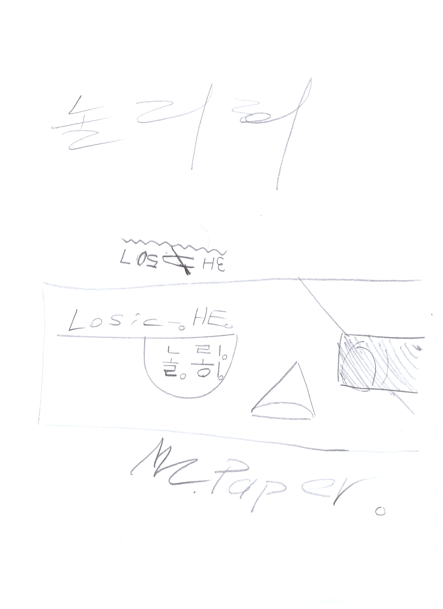
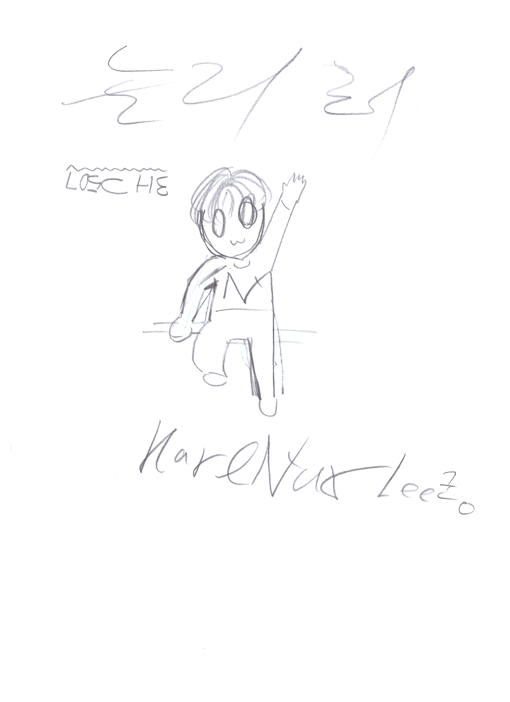
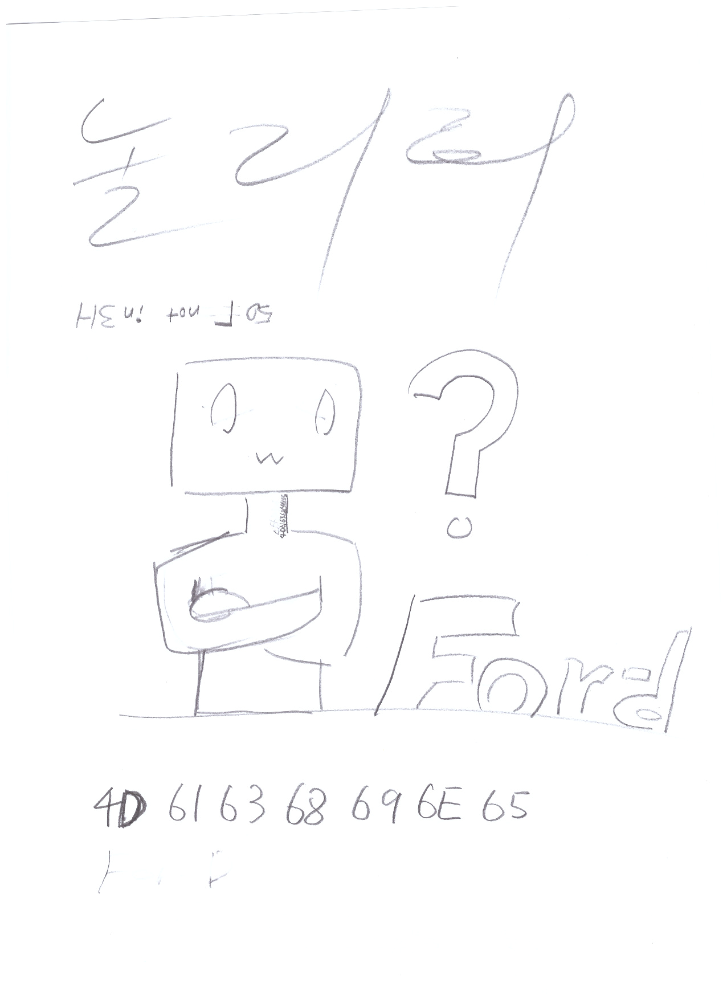
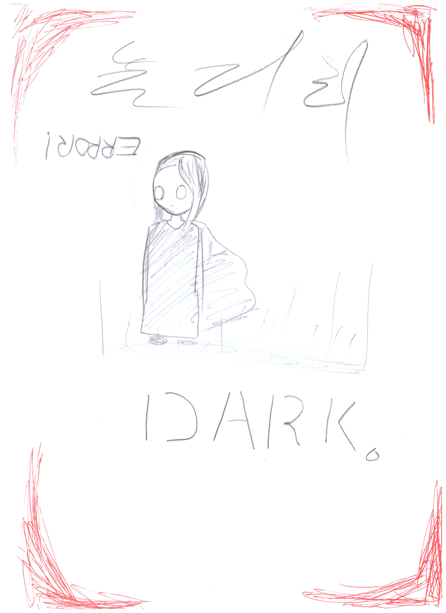
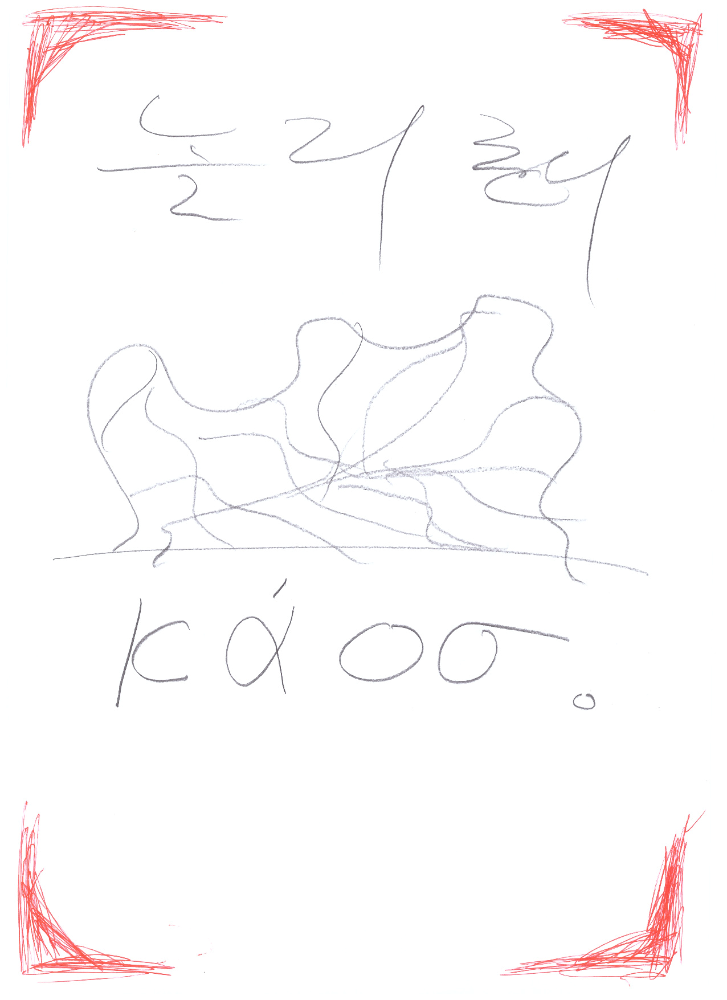

# Q. [이건](https://github.com/Tax0787/NollyHe) 뭐죠?
A. '놀리히' 연제처 리포지토리입니당 ㅎㅎ

## Q. 오..... 이거, 내용은 뭔가요?

A. 괴짜가 아포칼립스에서 살아남는거요

> ### Q. 왜 만들었나요?
>
> (마션 로고)
>
> 
> 
> A. [마션](https://ko.wikipedia.org/wiki/%ED%8C%8C%EC%9D%BC:%EB%A7%88%EC%85%98_%ED%91%9C%EC%A7%80.jpg#/media/%ED%8C%8C%EC%9D%BC:%EB%A7%88%EC%85%98_%ED%91%9C%EC%A7%80.jpg)같은 소설을 보고싶어서.... ...가 아니라 사실 [캐릭터](./KarlNuxLee.png) 그리다보니 귀여워서
>
> (그 캐릭터)
> 
> 
> 
> 
>
> > #### QnA. 오, 마션...., 그럼 이거 재미있나ㅇ... : 아뇨!, [재미없습니다.](https://namu.wiki/w/%EC%9E%90%ED%95%99)
> >
> > TMI : ㅖ, 그냥 끄적였습니다. ㅖ.
> >
> > 

## 주소

소설 : [https://tax0787.github.io/NollyHe-Novel](https://tax0787.github.io/NollyHe-Novel)

웹툰 : [https://tax0787.github.io/NollyHe-WebToon](https://tax0787.github.io/NollyHe-WebToon)

### POSTER

### 주제가

## 리포지토리

소설 : [https://github.com/tax0787/NollyHe-Novel](https://github.com/tax0787/NollyHe-Novel)

웹툰 : [https://github.com/tax0787/NollyHe-WebToon](https://github.com/tax0787/NollyHe-WebToon)

## 연재

### 시간

불특정.

### 어떻게 만드실지

#### [소설 (사이트)](https://Tax0787.github.io/NollyHe-Novel) [소설 (레포지토리)](https://github.com/Tax0787/NollyHe-Novel)

[포멧](https://github.com/Tax0787/NollyHe-Novel/blob/main/mn_format.py)이랑 [편집기](https://github.com/Tax0787/NollyHe-Novel/blob/main/editer.py)가 있습니다.

#### [웹툰 (사이트)](https://Tax0787.github.io/NollyHe-WebToon) [웹툰 (레포지토리) ](https://github.com/Tax0787/NollyHe-WebToon)

png 파일을 [웹툰 FW](https://github.com/Tax0787/NollyHe-WebToon/blob/main/main.py)에 넣을겁니다
